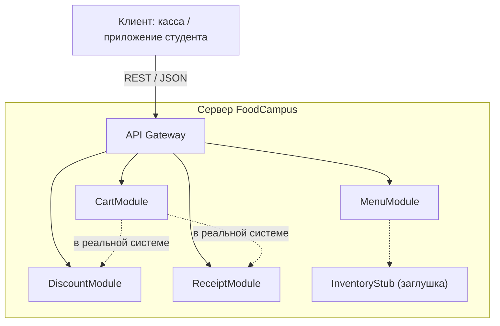

# Лабораторная работа №3 — Модуль MenuModule (проект «FoodCampus»)

## 1. Выбранные User Story и модуль

**User Story:** Как повар, я хочу фильтровать блюда по категориям, чтобы выдавать актуальное меню.
**Модуль:** `MenuModule`, метод `get_filtered_menu(category, only_available)`.
**Зона ответственности:** хранение списка блюд, фильтрация по категории (суп, второе, ...) и наличию.

## 2. Модульная архитектура (клиент-сервер)

- Клиент отправляет запрос (например, `GET /menu?category=суп&only_available=true`).
- API Gateway маршрутизирует запрос в нужный модуль.
- Модули независимы, общаются только через утверждённые интерфейсы.
- `MenuModule` зависит от склада, поэтому используется **Stub** `InventoryStub.is_in_stock()` (всегда `True`).

## 3. Интерфейс модуля

| Параметр | Тип | Описание |
|---|---|---|
| `category` | `str` или `None` | Одна из: суп, второе, салат, напиток, десерт. `None` — все. Регистр и пробелы по краям игнорируются |
| `only_available` | `bool` | `True` — только блюда в наличии |
| **Возвращает** | `list[dict]` | Копии блюд, подходящих под фильтр |
| **Ошибки** | `MenuError` | Неверный тип, неизвестная или слишком длинная (>50) категория |

## 4. Тестирование

Файл `test_menu.py`: 6 позитивных тестов (T1–T6) и 10 негативных (N1–N10).
Результат финального прогона: **16 PASS, 0 FAIL**.

## 5. Bug Report

Баги найдены стресс-тестом на первой (наивной) версии модуля и затем исправлены.

| ID | Модуль и метод | Входные данные | Ожидаемый результат | Фактический результат | Статус |
|---|---|---|---|---|---|
| BUG-01 | MenuModule.get_filtered_menu | `category="пицца"` (несуществующая) | Сообщение об ошибке | Тихо возвращён пустой список `[]` — не отличить от «в категории нет блюд» | Исправлен |
| BUG-02 | MenuModule.get_filtered_menu | `category="Суп"` и `" суп "` | Найдены супы (регистр и пробелы не важны) | Пустой список `[]` | Исправлен |
| BUG-03 | MenuModule.get_filtered_menu | `category=123` (число вместо текста) | Ошибка о неверном типе | Пустой список `[]` | Исправлен |
| BUG-04 | MenuModule.get_filtered_menu | `only_available="нет"` (строка) | Ошибка о неверном типе | Строка считается `True`, применён фильтр наличия | Исправлен |
| BUG-05 | MenuModule.get_filtered_menu | Изменение цены в возвращённом списке (`result[0]["price"] = -999`) | Внутренние данные меню не меняются | Цена в хранилище стала `-999` (возвращались ссылки) | Исправлен (возвращаются копии) |
| BUG-06 | MenuModule (данные) | Блюдо с ценой `-50` или без поля `category` | Понятная ошибка при создании | Отрицательная цена принята; для неполного блюда — `KeyError 'category'` | Исправлен (валидация, `MenuError`) |
| BUG-07 | MenuModule.get_filtered_menu | `category="а"*10000` | Ошибка о слишком длинной строке | Обработана как обычная, пустой результат | Исправлен |

## 6. Канбан-доска

| To Do | In Progress | Done |
|---|---|---|
| CartModule | | **MenuModule** (код, тесты, Bug Report) |
| DiscountModule | | |
| ReceiptModule | | |

*(вставьте скриншот своей доски: карточка MenuModule в колонке «Done»)*

## 7. Вывод

Модуль реализован и протестирован изолированно с помощью заглушки склада и тестового драйвера. Негативное тестирование выявило 7 дефектов, связанных с валидацией входных данных; все исправлены, регрессия покрыта тестами N1–N10.
