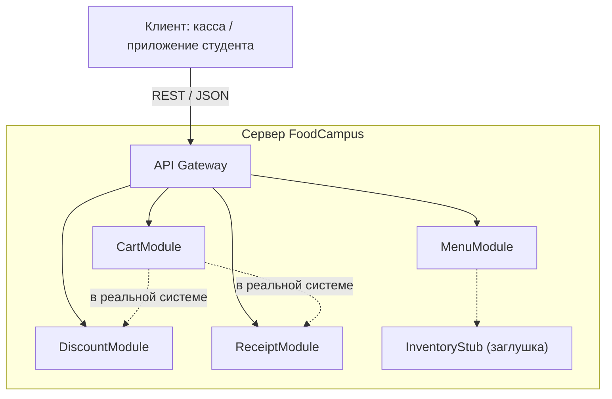

# Лабораторная работа №3 — Модуль MenuModule (проект «FoodCampus»)

## 1. Выбранные User Story и модуль

**User Story:** Как повар, я хочу фильтровать блюда по категориям, чтобы выдавать актуальное меню.
**Модуль:** `MenuModule`, метод `get_filtered_menu(category, only_available)`.
**Зона ответственности:** хранение списка блюд, фильтрация по категории (суп, второе, ...) и наличию.

## 2. Модульная архитектура (клиент-сервер)

- Клиент отправляет запрос (например, `GET /menu?category=суп&only_available=true`).
- API Gateway маршрутизирует запрос в нужный модуль.
- Модули независимы, общаются только через утверждённые интерфейсы.
- `MenuModule` зависит от склада, поэтому используется **Stub** `InventoryStub.is_in_stock()` (всегда `True`).

## 3. Интерфейс модуля

| Параметр | Тип | Описание |
| --- | --- | --- |
| `category` | `str` или `None` | Одна из: суп, второе, салат, напиток, десерт. `None` — все. Регистр и пробелы по краям игнорируются |
| `only_available` | `bool` | `True` — только блюда в наличии |
| **Возвращает** | `list[dict]` | Копии блюд, подходящих под фильтр |
| **Ошибки** | `MenuError` | Неверный тип, неизвестная, пустая или слишком длинная (>50) категория |

Данные блюд проверяются при создании модуля: все поля обязательны, цена — конечное число >= 0, `id` уникальны.

## 4. Тестирование

Файл `test_menu.py`: 6 позитивных тестов (T1–T6) и 14 негативных (N1–N14).
Результат финального прогона: **20 PASS, 0 FAIL**.

## 5. Bug Report

Баги BUG-01…BUG-07 воспроизведены на первой (наивной) версии `menu_naive.py` скриптом `demo_bugs.py`; фактические результаты ниже взяты из его вывода. BUG-08 и BUG-09 найдены при повторном анализе валидации; наивная версия их тоже не ловит (см. `demo_bugs.py`). Все баги исправлены в `menu.py`.

| ID | Модуль и метод | Входные данные | Ожидаемый результат | Фактический результат | Статус |
| --- | --- | --- | --- | --- | --- |
| BUG-01 | MenuModule.get_filtered_menu | `category="пицца"` | Сообщение об ошибке | Тихо возвращён `[]` — не отличить от «в категории нет блюд» | Исправлен |
| BUG-02 | MenuModule.get_filtered_menu | `category="Суп"` и `" суп "` | Найдены супы | `[]` (0 блюд) | Исправлен |
| BUG-03 | MenuModule.get_filtered_menu | `category=123` | Ошибка о неверном типе | `[]` | Исправлен |
| BUG-04 | MenuModule.get_filtered_menu | `only_available="нет"` | Ошибка о неверном типе | Строка считается `True`, применён фильтр наличия (вернулся `['Борщ']`) | Исправлен |
| BUG-05 | MenuModule.get_filtered_menu | `result[0]["price"] = -999`, затем повторный запрос | Внутренние данные не меняются | Цена в хранилище стала `-999` (возвращались ссылки) | Исправлен (возвращаются копии) |
| BUG-06 | MenuModule (данные) | Блюдо с ценой `-50`; блюдо без поля `category` | Понятная ошибка при создании | Цена `-50` принята; для неполного блюда — `KeyError: 'category'` | Исправлен (валидация, `MenuError`) |
| BUG-07 | MenuModule.get_filtered_menu | `category="а"*10000` | Ошибка о слишком длинной строке | Обработана как обычная, `[]` | Исправлен |
| BUG-08 | MenuModule (данные) | Цена `float("nan")` / `inf` | Ошибка валидации | Принято без ошибки (`nan < 0` даёт `False`) | Исправлен (`math.isnan`, `math.isinf`) |
| BUG-09 | MenuModule (данные) | Два блюда с одинаковым `id` | Ошибка валидации | Принято без ошибки | Исправлен (проверка уникальности) |

## 6. Канбан-доска

Ссылка на доску: **<ВСТАВЬТЕ_ССЫЛКУ>**

## 7. Вывод

Модуль реализован и протестирован изолированно с помощью заглушки склада и тестового драйвера. Негативное тестирование выявило 9 дефектов, связанных с валидацией входных данных; все исправлены, регрессия покрыта тестами N1–N14.
